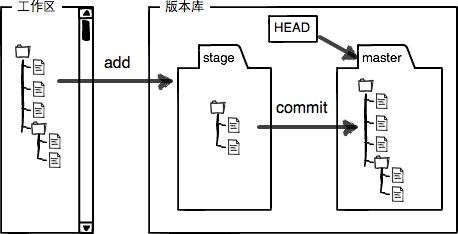
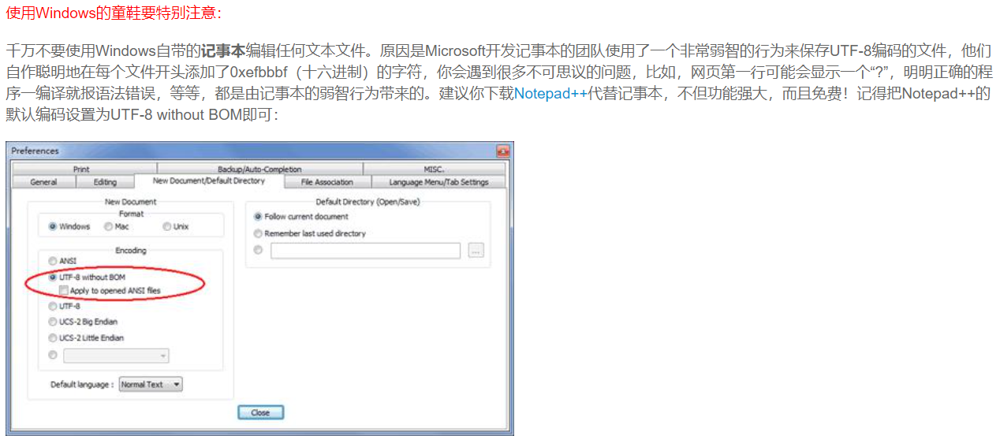
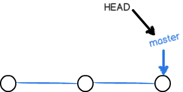
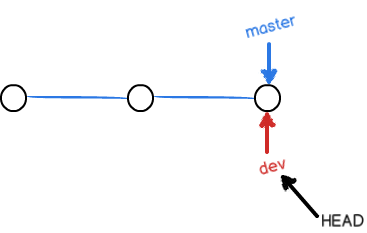
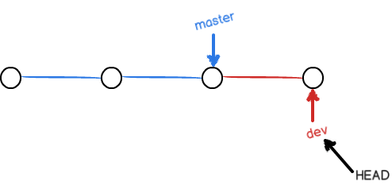
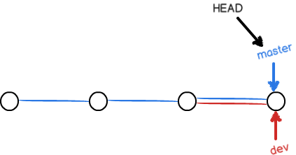
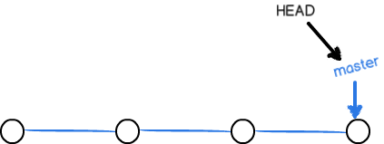

# 什么是Git？

<hr>
Git是目前世界上最先进的分布式版本控制系统。


# 分布式or集中式

<hr>
## 集中式

版本库存放在中央服务器，每次更改从中央服务器中取出最新的版本到本地，更改完成后再提交给中央服务器。

* 必须联网才能工作，受网速影响。

## 分布式

每个人的电脑上都是一个完整的版本库。仅存在一个充当“中央服务器”的电脑，用于交换各自的修改，不存在也能正常使用。

* 仅相互推送修改。

* 相比于集中式版本控制系统来说，安全性更高。（每个人的电脑中都有完整版）
* Git还具有强大的分支管理。

# 环境配置

<hr>


```bash
# 配置用户名
git config --global user.name "username"    //（ "username"是自己的账户名，）
# 配置邮箱
git config --global user.email "username@email.com"     //("username@email.com"注册账号时用的邮箱)
# 查看以上配置
git config --global --list
# 生成ssh
ssh-keygen -t rsa
# 测试是否配置成功(需要先将公钥添加至github)
ssh -T git@github.com
```


# 创建版本库

<hr>
1. 使用如下命令创建一个新目录

   ```bash
   $ mkdir learngit //创建一个名叫learngit的空目录(windows系统目录名不为中文)
   $ cd learngit //把learngit设置为当前目录
   $ pwd //查看当前目录
   /c/Users/Administrator/learngit
   ```

2. 把当前目录变为Git可以管理的仓库

   ```bash
   $ git init
   Initialized empty Git repository in /Users/Administrator/learngit/.git/
   ```

3. 把文件添加至版本库

   （1）把文件添加至仓库 git add

   ```bash
   $ git add $filename.txt$
   ```

   （2）把文件提交到仓库 git commit -m "xxx"

   ```bash
   $ git commit -m "wrote a readme file" //-m后面输入的是本次提交的说明，可以输入任意内容。
   [master (root-commit) eaadf4e] wrote a readme file
    1 file changed, 2 insertions(+) //1 file changed：1个文件被改动（新添加的readme.txt文件）；2 insertions：插入了两行内容（readme.txt内有两行内容）
    create mode 100644 readme.txt
   ```

4. 修改文件

   git status命令告诉我们文件是否被修改，以下说明已经被修改了。

   ```bash
   $ git status //查看仓库当前的状态
   On branch master
   Changes not staged for commit: //没有文件将要被提交
     (use "git add <file>..." to update what will be committed)
     (use "git checkout -- <file>..." to discard changes in working directory)
    
       modified:   readme.txt
    
   no changes added to commit (use "git add" and/or "git commit -a")
   ```

   git diff命令查看上次是如何修改当前文件的。

   ```bash
   $ git diff readme.txt 
   diff --git a/readme.txt b/readme.txt
   index 46d49bf..9247db6 100644
   --- a/readme.txt
   +++ b/readme.txt
   @@ -1,2 +1,2 @@
   -Git is a version control system. //这一句是被删掉的
   +Git is a distributed version control system. //这一句是新添加的
    Git is free software.
   ```

   接下来仍旧使用git add + git commit上传文件。

5. 版本退回

   可以使用``git log``或`git log --pretty=oneline`命令查看历史记录，后者显示为commit id（每个人都不同） + 版本描述信息。 

   使用`cat $filename.txt$`查看文件内容。

   使用git reset命令退回版本

   ```bash
   $ git reset --hard HEAD^ //HEAD表示当前版本，则HEAD^表示上一个版本，那么上上版本就是HEAD^^
   HEAD is now at e475afc add distributed
   ```

   当你现在想用`$ git reset --hard HEAD^`回退到前一个版本（之前的最新版）时，就必须找到它的commit id，仍旧使用git reset命令。

   可以使用命令`git reflog`用来记录每一次命令，借此查找commit id。

   ```bash
   $ git reset --hard 1094a //这里不能用HEAD而必须使用 commit id ，因为最新版本在之前返回时已经被删除了，1094a就是最新版本的 commit id，可以在之前的log代码中查到HEAD is now at 83b0afe append GPL
   ```

   

# 工作区和暂存区

<hr>
## 工作区（Working Directory）

一个仓库（learnGit目录文件夹）是一个工作区。

## 版本库（Repository）

工作区中有一个隐藏目录.git，是Git的版本库。

版本库里面的index（stage）文件叫暂存区，还有Git自动创建的第一个分支master，以及指向master的一个指针HEAD。

* commit命令仅提交已被add到暂存区的修改。
* 使用`git diff HEAD -- $filename.txt$`命令查看工作区和版本库中最新版本的区别。




# 管理修改

<hr>


Git管理的不是文件，而是修改。

* 二进制文件无法跟踪其改动，如Microsoft的word（二进制文件）。

* 只能跟踪纯文本文件的修改。（强烈建议使用UTF-8编码）

  

##  如何撤销修改？

1. 只在工作区修改了，没有add。

   手动删除想要撤销的内容或使用`git checkout -- $filename.txt$`丢弃工作区的修改。

2. add了，但还没有commit。

   git status命令显示“changes to be committed”，可以使用`git reset HEAD $filename.txt$`命令将暂存区的修改撤销掉，重新放回工作区。

   此时再使用git status命令显示“changes not staged for commit”，再使用`git checkout -- $filename.txt$`。

3. 已经commit过了。

   见版本回退内容。

# 删除文件

<hr>


```bash
$ rm test.txt
```

分两种情况：

（1）确实要从版本库中删除该文件，使用git rm+git commit


```bash
$ git rm test.txtrm 'test.txt'$ git commit -m "remove test.txt"[master d46f35e] remove test.txt1 file changed, 1 deletion(-)delete mode 100644 test.txt
```

此时该文件被从版本库中删除。

（2）文件被删错了，可以用版本库的版本替换工作区的版本。

```bash
$ git checkout -- test.txt
```


#  远程仓库

<hr>


将本地创建的git仓库和GitHub上的git仓库远程同步。

在本地learnGit仓库下运行命令：

```bash
$ git remote add origin git@github.com:$accountname$/learngit.git //“origin是远程仓库名字,是Git的默认叫法
```

然后将本地库的所有内容推送到远程库上：

```bash
$ git push -u origin master Counting objects: 20, done.Delta compression using up to 4 threads.Compressing objects: 100% (15/15), done.Writing objects: 100% (20/20), 1.64 KiB | 560.00 KiB/s, done.Total 20 (delta 5), reused 0 (delta 0)remote: Resolving deltas: 100% (5/5), done.To github.com:RFHzhj/learngit.git * [new branch]      master -> masterBranch 'master' set up to track remote branch 'master' from 'origin'.
```

因为远程库在第一次建立时是空的,所以使用`-u`参数，Git不但把本地的master分支内容推送到远程新的master分支，还会将二者联系起来，使以后的推送或拉取更加简便。

以后只要本地做了提交，就可以通过命令

```bash
$ git push origin master
```

将本地master分支的最新修改推送至GitHub，即建立了真正的分布式版本库。

## 将本地项目上传至GitHub的仓库中

1. 在本地创建一个版本库（即文件夹），通过git init把它变成Git仓库；

2. 把项目复制到这个文件夹里面，再通过git add .把项目添加到仓库；

3. 再通过git commit -m "注释内容"把项目提交到仓库；

4. 在Github上设置好SSH密钥后，新建一个远程仓库，通过git remote add origin https://github.com/guyibang/TEST2.git将本地仓库和远程仓库进行关联；

5. 最后通过git push -u origin master把本地仓库的项目推送到远程仓库（也就是Github）上；（若新建远程仓库的时候自动创建了README文件会报错，解决办法看上面）。

或者

1. 在本地创建一个空文件夹，然后右键Git Bash Here，输入**git clone + 你的仓库地址**。

2. 完成后本地会出现一个与仓库同名的文件夹，将所需要上传的文件夹复制到当前文件夹下。同时cd进入该文件夹。

3. 依次输入以下代码：

```bash
$ git init$ git add .$ git commit -m “你的提交信息”$ git push
```

* 如果`git push`不成功, `git push -u origin master`也不能解决问题，如果是因为github中的README.md文件不在本地代码目录中， 可以通过如下命令进行代码合并
  `git pull --rebase origin master`
  这里，pull=fetch+merge。合并后再用`git push`就可以上传了。
* 要克隆一个仓库，首先必须知道仓库的地址，然后使用`git clone`命令克隆。
* Git支持多种协议，包括`https`，但`ssh`协议速度最快。


# 分支管理

<hr>


在版本回退里，每次提交Git都把它们串成一条时间线，这条时间线就是一个分支。

截止到目前只有一条时间线，在Git里，该分支叫做主分支，即`master`。

`HEAD`指针并不指向提交，而是指向`master`，由`master`指向提交，即`HEAD`指向当前分支。

* 一开始的时候，`master`分支是一条线，Git用`master`指向最新的提交，再用`HEAD`指向`master`，就能确定当前分支，以及当前分支的提交点：



* 每次提交，`master`分支都会向前移动一步，这样，随着你不断提交，`master`分支的线也越来越长。
* 当我们创建新的分支，例如`dev`时，Git新建了一个指针叫`dev`，指向`master`相同的提交，再把`HEAD`指向`dev`，就表示当前分支在`dev`上：



```bash
$ git checkout -b devSwitched to a new branch 'dev'
```

相当于

```bash
$ git branch dev #创建分支$ git checkout dev #切换分支到devSwitched to branch 'dev'
```

`git branch`命令查看当前分支

```bash
$ git branch #列出所有的分支* dev #星号表示当前分支  master
```

* 从现在开始，对工作区的修改和提交就是针对`dev`分支了，比如新提交一次后，`dev`指针往前移动一步，而`master`指针不变：



* 假如我们在`dev`上的工作完成了，就可以把`dev`合并到`master`上。Git怎么合并呢？最简单的方法，就是直接把`master`指向`dev`的当前提交，就完成了合并：



用`git checkout master`切换回`master`分支后：

```bash
$ git merge dev #合并指定分支到当前分支Updating d46f35e..b17d20eFast-forward readme.txt | 1 + 1 file changed, 1 insertion(+)
```

* 合并完分支后，甚至可以删除`dev`分支。删除`dev`分支就是把`dev`指针给删掉，删掉后，我们就剩下了一条`master`分支：



```bash
$ git branch -d dev #删除分支Deleted branch dev (was b17d20e).
```

